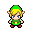

# poe2d

## Quickstart

```bash
git clone --recursive https://github.com/bernhardfritz/poe2d.git
cd poe2d
mkdir build
cd build
cmake ..
make
./sketch
```

## IntelliSense for vscode

* Open directory `poe2d` in vscode, e.g. by typing `code .` in terminal while your working directory is `poe2d`
* Press `ctrl/command` + `shift` + `p`
* Select `C/Cpp: Edit Configurations...`
* Edit the `includePath` array:

```JSON
{
    ...
    "includePath": [
        "${workspaceFolder}/include",
        "${workspaceFolder}/lib/libxd/include"
    ]
    ...
}
```

## Pixel art guidelines

By following the principles of [creative limitation](https://en.wikipedia.org/wiki/Creative_limitation) the following limitations have been chosen:

* Use a canvas size of 32x32 px
* Only use colors from this color palette:


When saving your sprite, make sure your graphics editor does not resample your image using something like "bilinear" or "bicubic" interpolation. [Nearest-neighbor interpolation](https://en.wikipedia.org/wiki/Nearest-neighbor_interpolation) is fine.
* Once you are done, save a copy of your sprite into the `32x32` folder
* For the next step open a terminal in `build`
* Apply the [hqx](https://en.wikipedia.org/wiki/Hqx) algorithm with 2x magnification to your sprite and save the result into the `64x64` folder:

```bash
./lib/hqx/hqx -s 2 ../32x32/link.png ../64x64/link.png
```

 

This trick can be a huge time saver when working on animated sprites.
