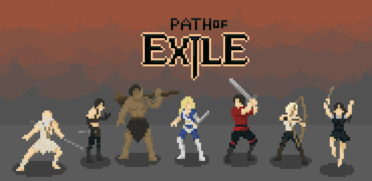

# poe2d



## Quickstart

```bash
git clone --recursive https://github.com/bernhardfritz/poe2d.git
cd poe2d
mkdir build
cd build
cmake ..
make
./sketch
```

## IntelliSense for vscode

* Open directory `poe2d` in vscode, e.g. by typing `code .` in terminal while your working directory is `poe2d`
* Press `ctrl/command` + `shift` + `p`
* Select `C/Cpp: Edit Configurations...`
* Edit the `includePath` array:

```JSON
{
    ...
    "includePath": [
        "${workspaceFolder}/include",
        "${workspaceFolder}/lib/libxd/include"
    ]
    ...
}
```

## Pixel art guidelines

By following the principles of [creative limitation](https://en.wikipedia.org/wiki/Creative_limitation) the following limitations have been chosen:

* Use a canvas size of 32x32 px
* Only use colors from this color palette:


If you want to use existing pixel art that uses colors other than those specified above please [remap](https://github.com/bernhardfritz/remap) them.

When creating your own pixel art, make sure your graphics editor does not resample your image using something like "bilinear" or "bicubic" interpolation.
[Nearest-neighbor interpolation](https://en.wikipedia.org/wiki/Nearest-neighbor_interpolation) is fine.

When working on pixel art it is a good idea to start small. 32x32 pixels should be good enough.
It is always possible to upscale your pixel art later using [hqx](https://github.com/bernhardfritz/hqx).
This trick can also be a huge time saver when working on animated sprites.

## Dungeon guidelines

We will use the popular map editor called [Tiled](https://www.mapeditor.org/) to create our dungeons.

Tiled provides us
* a way to organize our tiles into tilesets
* a map editor that allows us to create our own dungeons

Tiled also allows us to store additional information about tiles inside the tileset files, like collision boxes or how tiles are animated.

Tilesets as well as maps can be stored in several file formats (e.g. JSON).
We still need to evaluate which one can be imported into our game the easiest.
There are several libraries available, it's just a matter of picking the right one.

Currently there is one dungeon tileset included in this repository.
It would already be possible to create your own dungeons.
If you do consider creating your own dungeon using Tiled, make sure you select tilesize 32x32 when creating a new map.
